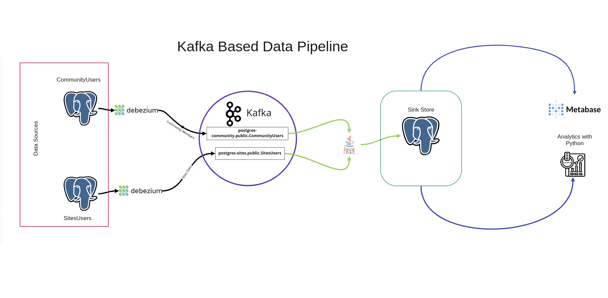

# moodle_Data_Pipeline

## Challenge Description

Propose a detailed solution for the given scenario (sinks, producers, consumers, etc).

Please list the technologies involving the Kafka cluster, languages used and the final data pipeline from end to end (preferred in a flow chart):

### Scenario  

* Moodle has 2 public sites, Moodle Community & Moodle Sites. They are not connected and don't share users  
* Moodle Community has open forums for registered users (using their email)  
* Moodle Sites has registration data of customers using/installing Moodle (part of the data sent for registration is the administrator email)  
* Both sites have all data in different databases and their logs are sent to a central repository  

### We want to know

* Number of sites being registered weekly and its time evolution  
* Number of users from Moodle Community administrating registered sites and its time evolution  

Please add a coded solution to solve the connection between the producer, the data source and the cluster. We have some solutions coded in bash and others in python, feel free to choose any of them or another language.

## My Approach

I will be assuming that the two data sources are accessible through a host name and for simplifying things I will consider them as both being postgres databases. The solution that I am proposing here will combine the two databases and enable us to make different join queries to answer interesting questions.

For combining the data bases I will use a Kafka cluster and the Kafka Connect ecosystem. Kafka connect allows me to connect different sources and sinks to my kafka cluster without having to worry about the publisher operations, consumer operations, and issues with scaling. It also provides change data capture capabilities. I will use two debezium source connectors for connecting my postgres data sources to my Kafka instance. The connectors will publish the data in the tables of the data sources to a corresponding Kafka topic. The other connector is a JDBC connector for writing-out the data in the Kafka topics to a single data store. This is again a postgres database, but it could be any kind of data store technology. By utilizing kafka and kafka connect the main problem is solved. Now for the fun part.

There are a few different ways to solve the business questions. I will show two options here. One is using tools like looker, metabase or power BI. The other is working with the data in the sink store using Python. I have used the metabase tool from the visualization options since it is open source and allows non technical individuals to use its interface and perform analytical queries. I have also used Python to query the data and answer the questions using a Jupyter Notebook environment and some Pandas magic. I will be extending this to a small dashboard that will update itself as the data changes.

## Implementation

There are 3 main components in this project. The source data, The Kafka and Kafka components and BI-Tools. All the components have been containerized using docker and run on the same docker network. I will go over each in more detail next.

### The source data

Since I was not provided with sample data to work with, I decided to create two containerized data generators with their own postgres data stores. I used the python Faker library to create the users data for both data stores. And as the number of users grew the random generator would create some email on both databases. This allowed me to simulate the site admins that also use the community forum. I also containerized each generator to simulate the real data source being in separate databases. It also keeps adding new users with a set time interval. This was the table format I created.
***CommunityUsers***:
|Column Name| Data Type| Default|
|:----|:----|:----|
|id| PK Serial| Not Null|
|email| varchar| Not Null|
|username| varchar| Not Null|
|registration_timestamp| varchar| Not Null|

***SitesUsers***:
|Column Name| Data Type| Default|
|:----|:----|:----|
|id| PK Serial| Not Null|
|admin_email| varchar| Not Null|
|username| varchar| Not Null|
|registration_timestamp| varchar| Not Null|

### Kafka and Kafka Connect

Here I had the following docker containers.

* Three kafka brokers,
* One zookeeper instance,
* Two debezium source connectors,
* One JDBC sink connector
* One postgres sink datastore

The debezium connectors would catch changes on the data sources above and publish it to a Kafka topic corresponding to the table they each monitor. In this case the tables are SitesUsers and CommunityUsers. The debezium connectors follow a fully defined naming convention when creating the topics names they publish to. This name is the full name of the database table the topic corresponds to. In this case the topic names will follow this format. <database-host>.<schema>.<table_name>
This results in the following topic names on kafka.

* postgres-community.public.CommunityUsers
* postgres-sites.public.SitesUsers

The JDBC connector will monitor the above two topics as a consumer and send any new data it gets to the sink store. It creates tables on the sink store using the kafka topic names table_name part.

Whenever there is a change in the source data status,  the debezium connectors will notice and publish it to kafka topics and the JDBC connector will catch those new changes from Kafak and send them to the sink store.

### Business Intelligence Tools

Once we have the data in a centralized store, it becomes easy to add any BI-tool that allows us to query the database and perform our analysis. Here , I have used a docker based instance of Metabase, which is an open-source visualization tool. I also have answered the business questions using pandas in a notebook.

## Future Works

* Showing the analysis done in python using a simple streamlit or Dash based dashboard instead of having it in a notebook.
* Adding dbt (data build tool) in between the sink store and BI-tools to allow different transformations to be created and saved back to the database. This would simplify the queries we write on our BI-Tools.
